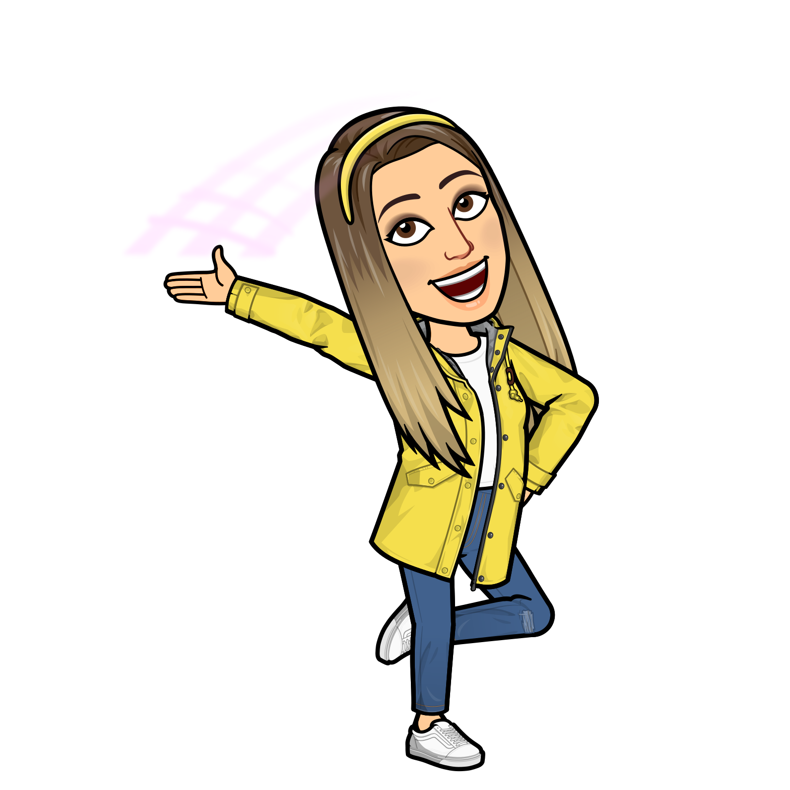
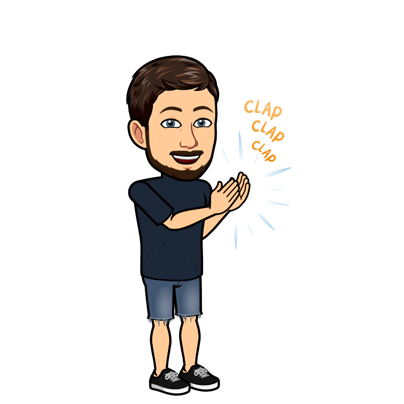
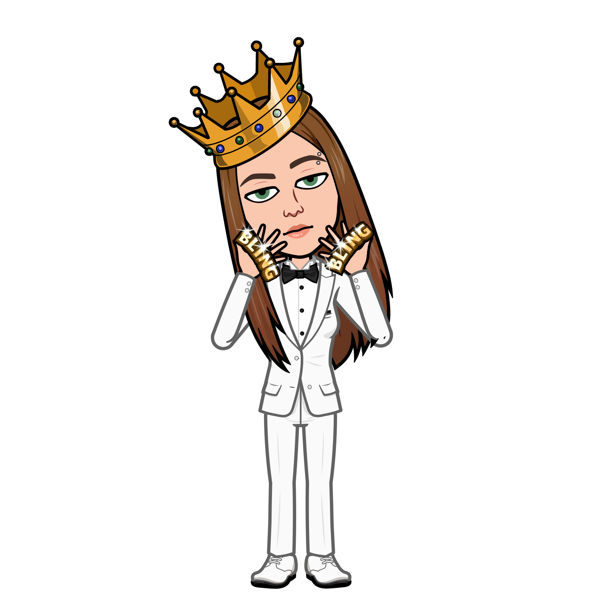

# Landing Page - Atividade de Mentoria de Carreira

Bem-vindo à nossa Landing Page da atividade de Mentoria de Carreira, onde você pode conhecer melhor nossos alunos e suas habilidades profissionais. Abaixo estão os perfis dos alunos participantes:

## Vídeo da Aplicação

Assista ao nosso vídeo introdutório para saber mais sobre a atividade de Mentoria de Carreira e como nossos alunos estão se preparando para o sucesso profissional.

https://github.com/Thamireslopescz/Mentoria-de-Carreira/assets/100656019/e85f83ab-47b3-40e6-8cc8-cceed90a61d2

## Alunos

### Andrea Noer

- **Descrição:** Andrea é uma pessoa criativa e inovadora, sempre trazendo novas ideias e perspectivas para qualquer projeto. Ela é organizada, confiável e altamente focada em alcançar metas.

- **Soft Skills:** Criatividade, Inovação e Confiabilidade

### Everton Cadona

- **Descrição:** Everton é um profissional dedicado e comprometido, conhecido por sua habilidade em resolver problemas de forma eficaz e sua capacidade de trabalhar bem em equipe. Ele também é conhecido por sua comunicação clara e habilidades interpessoais.

- **Soft Skills:** Dedicação, Habilidade em resolver problemas e Trabalho em equipe

### Luciano dos Reis

- **Descrição:** Luciano é muito tranquilo, conhecido por sua capacidade de motivar sua equipe. Ele é analítico e estratégico.

- **Soft Skills:** Tranquilidade, Serenidade e Despreocupação

### Matheus Falkenburg

- **Descrição:** Matheus é um indivíduo altamente resiliente e adaptável, capaz de lidar bem com desafios e pressão. Ele é proativo, dedicado e tem um forte compromisso com a excelência.

- **Soft Skills:** Dedicação, Adaptabilidade, Proatividade

### Thamires Lopes

- **Descrição:** Thamires é uma comunicadora excepcional, capaz de transmitir informações de forma clara e envolvente. Ela é altamente organizada, atenta aos detalhes e eficiente em seu trabalho.

- **Soft Skills:** Eficiência, Organização, Atenção aos detalhes e Comunicação

Esperamos que você aproveite esta oportunidade para conhecer nossos alunos e suas habilidades. Entre em contato conosco se tiver alguma dúvida ou se quiser saber mais sobre nossos programas de mentoria de carreira.

---

Este projeto foi desenvolvido pelo grupo como parte da atividade da turma 14° Dev Full Stack.
